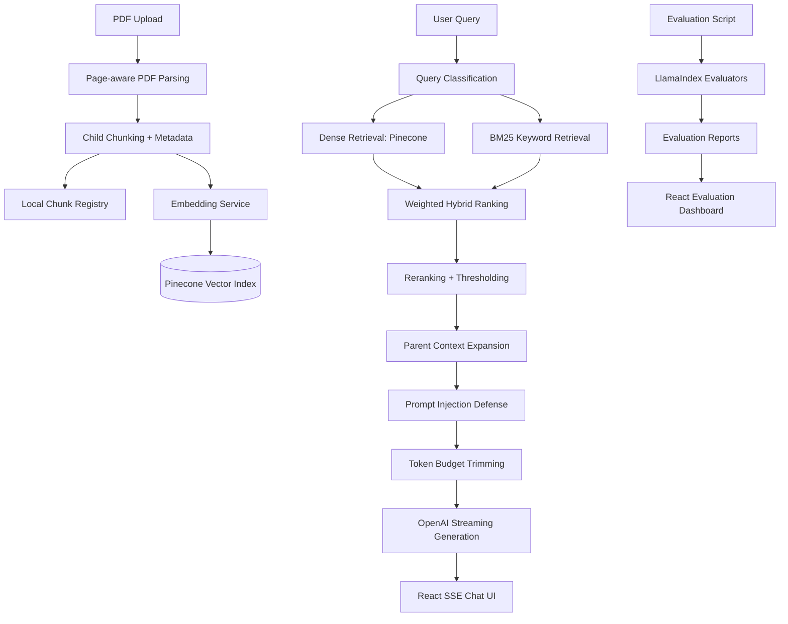

# QueryForge AI
### Production-Grade Explainable RAG System · FastAPI + React + Pinecone + OpenAI

**Built by: karthikeya**

[](https://python.org)
[](https://fastapi.tiangolo.com)
[](https://reactjs.org)
[](https://pinecone.io)
[](https://openai.com)
[](https://llamaindex.ai)

QueryForge AI is an explainable PDF RAG application upgraded from a basic document chatbot into a production-oriented GenAI system. It supports real-time token streaming, source-grounded citations, hybrid retrieval, parent/child context expansion, query classification, prompt-injection defenses, cost optimization, and a continuous RAG evaluation dashboard.

---

## What We Upgraded

### 1. Real-Time Streaming Responses

- Added `POST /api/query/stream` using Server-Sent Events.
- Streams OpenAI tokens incrementally into the React UI.
- Sends structured SSE events: `status`, `sources`, `token`, `done`, `error`, and `cancelled`.
- Handles browser disconnects gracefully.
- Added frontend retry and loading states.
- Maintains conversation state for follow-up queries.

### 2. Explainable Retrieval With Citations

- Returns source chunk references with every answer.
- Shows PDF page numbers, chunk IDs, confidence scores, and highlights.
- Adds frontend citation cards and clickable source references.
- Prevents hallucinated citations by allowing only backend-generated citation IDs.
- Attaches retrieval metadata to every response.

### 3. Hybrid Retrieval Architecture

- Combines Pinecone dense vector search with BM25 keyword search.
- Uses weighted ranking across dense score, BM25 score, and rerank score.
- Supports metadata filtering by document and chunk.
- Adds retrieval diagnostics for ranking strategy, result counts, latency, cache hits, and query type.

### 4. Parent/Child Retrieval

- Retrieves smaller child chunks for precision.
- Expands into adjacent parent context for generation.
- Keeps child chunk metadata for accurate citations.
- Improves coherence while preserving citation traceability.

### 5. Query Classification and Intelligent Routing

Queries are classified as:

- factual
- summarization
- citation-heavy
- broad search
- follow-up

The system dynamically adjusts:

- `top_k`
- dense/BM25/rerank weights
- token budget
- citation strictness

### 6. Prompt Injection Defense

- Treats retrieved chunks as untrusted evidence.
- Detects malicious instruction-like text such as “ignore previous instructions.”
- Adds suspicious content scoring.
- Sanitizes retrieved context before sending it to the LLM.
- Records security flags in source metadata.

### 7. Cost Optimization Layer

- Adds retrieval caching.
- Uses deterministic vector IDs and content hashes.
- Avoids duplicate chunk indexing.
- Estimates token usage.
- Applies adaptive context trimming by query type.

### 8. Continuous RAG Evaluation Pipeline

- Added automated batch evaluation script.
- Uses LlamaIndex evaluators for faithfulness and retrieval relevancy.
- Tracks hallucination rate, groundedness, confidence, recall, and latency.
- Persists evaluation runs.
- Adds React dashboard at `/evaluation` with charts and benchmark trends.

---

## Architecture



---

## API Surface

| Endpoint | Method | Description |
|---|---:|---|
| `/api/upload` | `POST` | Upload PDF, parse pages, create chunks, embed, and index in Pinecone |
| `/api/query` | `POST` | Non-streaming grounded answer with citations and metadata |
| `/api/query/stream` | `POST` | SSE streaming answer with live tokens and source events |
| `/api/list_documents` | `GET` | List indexed documents from the local document registry |
| `/api/evaluation/runs` | `GET` | List stored RAG evaluation run summaries |
| `/api/evaluation/runs/{run_id}` | `GET` | Load one evaluation run with detailed results |

---

## Current Backend Modules

```text
backend/
├── main.py
├── config.py
├── models/
│   ├── __init__.py
│   └── document.py
├── routes/
│   ├── upload.py
│   ├── query.py
│   ├── list_documents.py
│   ├── evaluation.py
│   └── retrieval.py
├── services/
│   ├── pdf_processor.py
│   ├── document_store.py
│   ├── vector_store.py
│   ├── hybrid_retriever.py
│   ├── llm_service.py
│   ├── embedding_service.py
│   ├── query_classifier.py
│   ├── prompt_security.py
│   ├── cache.py
│   ├── cost_optimizer.py
│   └── evaluation_store.py
└── scripts/
    └── evaluate_rag.py
```

---

## Current Frontend Modules

```text
ui-v1/src/
├── App.tsx
├── pages/
│   ├── Index.tsx
│   ├── EvaluationDashboard.tsx
│   └── NotFound.tsx
├── components/
│   ├── ChatInterface.tsx
│   ├── PDFUploader.tsx
│   ├── MessageItem.tsx
│   ├── ReferenceModal.tsx
│   ├── TypingIndicator.tsx
│   └── ui/
├── context/
│   └── PDFContext.tsx
├── types/
│   └── rag.ts
└── utils/
    └── pdfUtils.ts
```

---

## Quick Start

### Backend

```bash
cd backend
pip install -r requirements.txt
```

Create `.env`:

```bash
OPENAI_API_KEY=your_openai_key
PINECONE_API_KEY=your_pinecone_key
PINECONE_INDEX_NAME=queryforge-ai
PINECONE_CLOUD=aws
PINECONE_REGION=us-east-1
VECTOR_DB_DIMENSION=384
LLM_PROVIDER=openai
OPENAI_MODEL=gpt-4o-mini
EMBEDDING_PROVIDER=llama
```

Run:

```bash
uvicorn main:app --reload
```

### Frontend

```bash
cd ui-v1
npm install
npm run dev
```

Open:

```text
http://localhost:3000
```

Evaluation dashboard:

```text
http://localhost:3000/evaluation
```

---

## Running RAG Evaluation

Generate a synthetic benchmark from indexed chunks:

```bash
PYTHONPATH=backend python backend/scripts/evaluate_rag.py --limit 20
```

Evaluate a specific document:

```bash
PYTHONPATH=backend python backend/scripts/evaluate_rag.py --document-id <document_id> --limit 20
```

Outputs:

```text
backend/reports/rag_eval_report.json
backend/reports/rag_eval_report.csv
backend/reports/eval-*.json
```

Tracked metrics:

- answer faithfulness
- retrieval relevancy
- hallucination rate
- groundedness
- expected chunk recall
- confidence
- p95 latency

---

## Tech Stack

| Layer | Technology | Role |
|---|---|---|
| Backend | FastAPI | API, upload, retrieval, streaming, evaluation routes |
| Frontend | React + Vite | Chat UI, citation cards, evaluation dashboard |
| Streaming | Server-Sent Events | Live ChatGPT-style token rendering |
| LLM | OpenAI | Streaming answer generation |
| Embeddings | HuggingFace / OpenAI / Mistral via LlamaIndex wrappers | Chunk and query embeddings |
| Vector DB | Pinecone | Dense semantic retrieval |
| Keyword Search | BM25 | Exact term and citation-heavy retrieval |
| Evaluation | LlamaIndex evaluators | Faithfulness and relevancy scoring |
| Charts | Recharts | RAG quality dashboard visualization |

---

## Production Notes

- Replace the local JSON chunk registry with Postgres for multi-user production deployments.
- Move PDF ingestion into a background worker such as Celery, RQ, Arq, or Dramatiq.
- Add auth, tenant isolation, rate limits, and per-user Pinecone filters.
- Use object storage such as S3/GCS for uploaded PDFs.
- Add OpenTelemetry traces for ingestion, retrieval, reranking, generation, and evaluation.
- Lazy-load the `/evaluation` route to reduce the main frontend bundle size.
- Use a stronger reranker such as Cohere Rerank, BGE reranker, or a cross-encoder for higher retrieval quality.

---

## Repository

GitHub: `https://github.com/karthikeyakunnam/QueryForge_AI.git`

**Built by: karthikeya**
